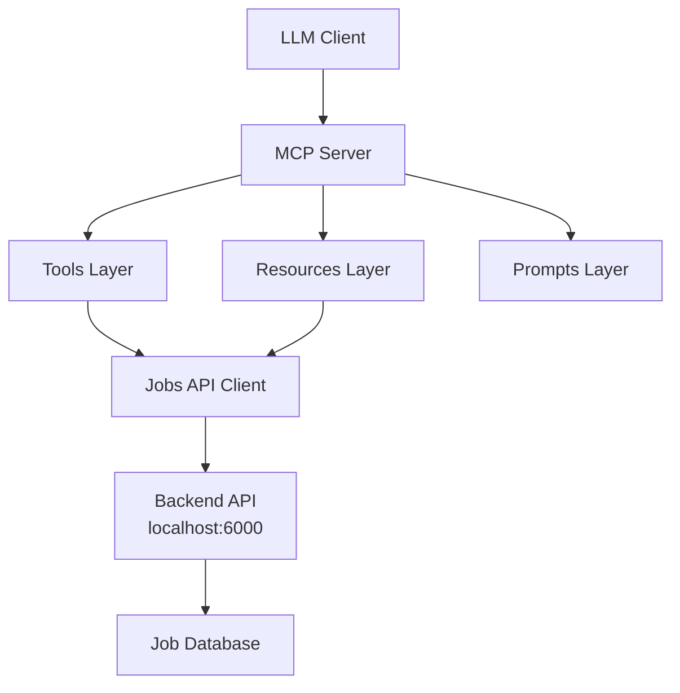

# Blue-Collar Jobs MCP Server

A modern Model Context Protocol (MCP) server for blue-collar job opportunities in India. This server provides LLMs with tools to search for jobs, get job details, submit applications, and provide career guidance.

## 🏗️ Architecture

This implementation uses the modern **@modelcontextprotocol/sdk** with a clean, modular architecture:

```
src/
├── types/           # TypeScript type definitions
│   └── job.ts       # Job-related types and Zod schemas
├── api/             # External API client
│   └── jobs-api.ts  # Jobs backend API client
├── resources/       # MCP Resources (data browsing)
│   └── index.ts     # API status, job listings, categories
├── tools/           # MCP Tools (actions)
│   └── index.ts     # Job search, details, applications, guidance
├── prompts/         # MCP Prompts (reusable templates)
│   └── index.ts     # Assistant prompts for different scenarios
├── index.ts         # Main server entry point
└── test.ts          # Component testing utilities
```

## 🚀 Features

### Resources (Data Browsing)
- **`blue-collar://api-status`** - API health and capabilities
- **`blue-collar://job-listings`** - Recent job postings preview
- **`blue-collar://job-categories`** - Job market statistics and categories

### Tools (Actions)
- **`search-jobs`** - Search with filters (city, state, job type, experience, skills)
- **`get-job-details`** - Get detailed job information by ID
- **`apply-for-job`** - Submit job applications
- **`job-application-guide`** - Personalized application guidance

### Prompts (Templates)
- **`blue-collar-assistant`** - Main system prompt for job assistance
- **`interview-prep`** - Interview preparation guidance
- **`career-development`** - Career growth and skill development advice

## 🛠️ Installation & Setup

### Prerequisites
- Node.js 18+ 
- TypeScript
- Running backend API at `http://localhost:6000`

### Install Dependencies
```bash
npm install
```

### Start the Server
```bash
# Development (with auto-reload)
npm run dev

# Production
npm start

# Build for distribution
npm run build
```

### Test Components
```bash
npm test
```

## 🔌 Backend API Integration

The server connects to a jobs backend API running at `http://localhost:6000` with these endpoints:

- `GET /health` - Health check
- `POST /api/jobs/search` - Search jobs with filters
- `GET /api/jobs/{jobId}` - Get job details
- `POST /api/jobs/{jobId}/apply` - Submit application

## 📝 Usage Examples

### Job Search
```typescript
// Search for delivery jobs in Bengaluru
{
  "tool": "search-jobs",
  "arguments": {
    "filters": {
      "city": "Bengaluru",
      "skills": ["Driving", "Navigation"]
    },
    "limit": 10
  }
}
```

### Get Job Details
```typescript
{
  "tool": "get-job-details", 
  "arguments": {
    "jobId": "JOB-1001-DEL"
  }
}
```

### Apply for Job
```typescript
{
  "tool": "apply-for-job",
  "arguments": {
    "jobId": "JOB-1001-DEL",
    "applicant": {
      "full_name": "John Doe",
      "phone_number": "+91-9876543210",
      "email": "john@example.com"
    }
  }
}
```

## 🎯 MCP Client Configuration

Add to your MCP client configuration:

```json
{
  "mcpServers": {
    "blue-collar-jobs": {
      "command": "node",
      "args": ["path/to/dist/index.js"],
      "env": {}
    }
  }
}
```

## 🔧 Development

### Modern MCP SDK Features Used

- **McpServer** - High-level server interface
- **Automatic capability detection** - No manual handler registration
- **Zod schema validation** - Type-safe parameter validation
- **Clean functional API** - `server.tool()`, `server.resource()`, `server.prompt()`

### Key Improvements Over Legacy Implementation

| Aspect | Legacy | Modern |
|--------|--------|--------|
| Setup | Manual handlers | Automatic detection |
| Validation | Custom logic | Built-in Zod schemas |
| Type Safety | Manual schemas | TypeScript + Zod |
| Code Organization | Single file | Modular structure |
| Error Handling | Manual responses | Built-in handling |

### Testing

The server includes comprehensive testing:

```bash
# Test API connectivity and components
npm test

# Test individual components
npm run test:components
```

## 📊 Data Flow



## 🌟 Key Benefits

1. **Modular Architecture** - Easy to extend and maintain
2. **Type Safety** - Full TypeScript + Zod validation
3. **Error Handling** - Graceful degradation when API unavailable
4. **User-Friendly** - Rich formatting and helpful guidance
5. **Scalable** - Clean separation of concerns
6. **Modern Standards** - Latest MCP SDK patterns

## 🔍 API Reference

### Search Jobs Tool
```typescript
interface SearchJobsParams {
  filters?: {
    city?: string;
    state?: string;
    jobType?: string;
    experience?: string;
    skills?: string[];
  };
  limit?: number;   // 1-100, default 50
  offset?: number;  // default 0
}
```

### Job Application Tool
```typescript
interface ApplyJobParams {
  jobId: string;
  applicant: {
    full_name: string;
    phone_number: string;
    email: string;
  };
}
```

### Supported Filters
- **Cities**: Bengaluru, Mumbai, Delhi, Noida, etc.
- **States**: Karnataka, Maharashtra, Delhi, Uttar Pradesh, etc.
- **Job Types**: full_time, part_time, contract
- **Experience**: 0-2 years, 2-5 years, 5+ years
- **Skills**: Driving, Customer Service, Inventory Management, etc.

## 🤝 Contributing

1. Follow the modular structure
2. Add proper TypeScript types
3. Include error handling
4. Update tests
5. Document new features

## 📜 License

ISC License - See package.json for details

---

Built with ❤️ for the blue-collar workforce in India 🇮🇳 